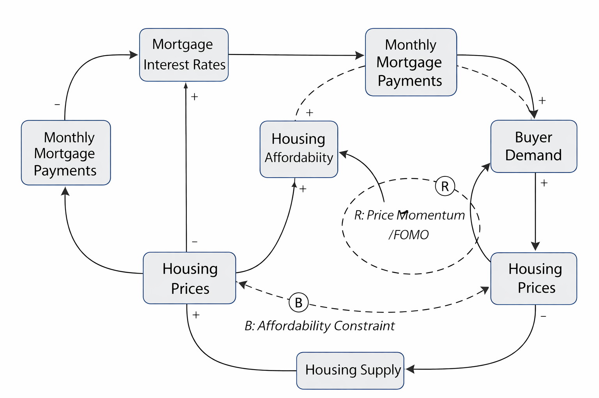

# Decision Intelligence for First-Time Homebuyers in Halifax

## Decision Statement
Should a first-time homebuyer in the Halifax Regional Municipality buy a home in 2026 or wait approximately 18 months given changing interest rates and housing market conditions?

## Executive Summary
First-time homebuyers in the Halifax Regional Municipality face a difficult timing decision as housing prices, mortgage interest rates, and affordability remain highly uncertain. Buying now may provide stability and protection against future price increases, but high borrowing costs and affordability constraints create significant financial risk. Waiting may allow buyers to benefit from potential interest rate reductions, but exposes them to continued price growth and rental market pressures.

This project uses a decision intelligence approach to help a first-time homebuyer evaluate this tradeoff. By combining housing market data, interest rate trends, and systems thinking, the analysis will clarify how affordability, demand, and prices interact over time. A causal loop diagram is used to highlight feedback mechanisms that influence buyer outcomes.

The goal of this analysis is not to predict the market perfectly, but to provide evidence-based insight that helps a buyer make a more informed decision under uncertainty.

## Initial Causal Loop Diagram

*This draft causal loop diagram illustrates reinforcing feedback between buyer confidence, demand, and housing prices, as well as balancing feedback driven by affordability constraints and interest rates.*
