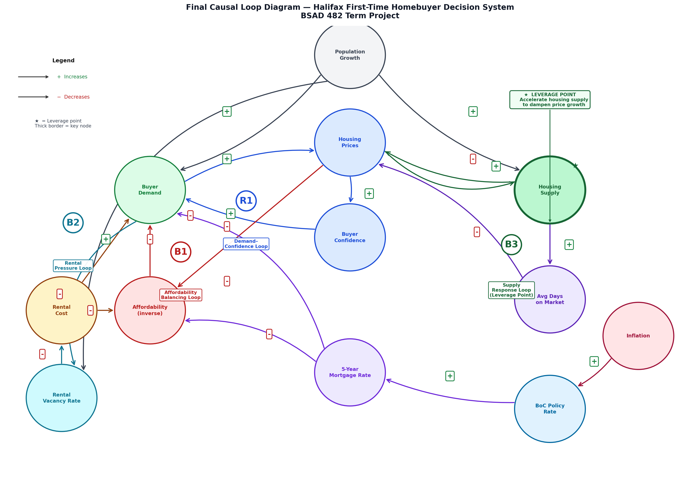

# Decision Intelligence for First-Time Homebuyers in Halifax

**Decision Statement:** Should a first-time homebuyer in the Halifax Regional Municipality buy a home in 2026 or wait approximately 18 months given changing interest rates and housing market conditions?

---

## Table of Contents

1. [Executive Summary](#executive-summary)
2. [Background](#background)
3. [Data Sources](#data-sources)
4. [Exploratory Findings](#exploratory-findings)
5. [System Dynamics](#system-dynamics)
6. [Analysis](#analysis)
7. [Recommendations](#recommendations)
8. [Limitations and Future Work](#limitations-and-future-work)
9. [References](#references)

---

## Executive Summary

First-time homebuyers in Halifax face one of the most difficult housing markets in the city's history. Between 2015 and 2025, the average home sale price nearly doubled — rising from approximately $285,000 to $530,000 — while the rental vacancy rate fell to a record low of 0.8% in 2022. Population growth of 37% over the same period consistently outpaced housing supply, creating structural upward pressure on prices that has not fully resolved even as interest rates have declined from their 2023 peak.

This project uses a decision intelligence framework to help a first-time buyer navigate this environment. Rather than attempting to predict prices or rates precisely, the analysis maps the feedback loops driving the Halifax housing system, identifies which forces are dominant, and evaluates what different decisions imply over a five-to-ten year horizon.

The core finding is that the Halifax housing system is operating under a Growth and Underinvestment archetype: demand has consistently grown faster than supply, and the supply response — while accelerating — arrives too slowly to benefit a buyer waiting in the near term. The data shows that waiting to purchase is not a cost-free option. Continuing to rent at $1,790 per month accumulates approximately $32,000 in costs over 18 months that build no equity, while prices are unlikely to fall significantly enough in that window to justify the delay. The recommendation developed in this project is that purchasing in 2026, or within a firm 12-month window, is the more defensible choice for a buyer with stable employment and adequate savings.

---

## Background

See [Background.md](Background.md) for full context, including a discussion of stakeholders, the tensions driving the decision, and what has been tried before.

---

## Data Sources

Three datasets were compiled for this analysis. Full documentation, including column definitions and APA citations, is in [data/README.md](data/README.md). Data cleaning decisions are documented in [Wrangling.md](Wrangling.md).

| Dataset | Description | Source | Coverage |
|---------|-------------|--------|----------|
| `interest_rates.csv` | BoC overnight rate and 5-year posted mortgage rate | Bank of Canada | Monthly, 2015–2026 |
| `halifax_housing_market.csv` | Average sale price, units sold, listings, inventory, days on market | NSAR / CMHC | Monthly, 2015–2025 |
| `hrm_affordability.csv` | Affordability ratio, population, housing starts, vacancy rate, rents | StatCan / CMHC | Annual, 2015–2025 |

---

## Exploratory Findings

### House Prices vs. Interest Rates Over Time

Between 2020 and 2022, the Bank of Canada cut its policy rate to near-zero in response to COVID-19. Halifax home prices responded with an 80% surge — from approximately $320,000 to over $580,000 — within two years. When the Bank reversed course and raised rates aggressively to 5.0% by mid-2023, prices corrected but did not return to pre-pandemic levels. By late 2025, with rates easing back to ~2.25%, prices have resumed a modest upward trend. The key insight for the decision-maker: rates have fallen significantly, but prices have not followed downward at the same scale. The window for a lower purchase price has largely passed.

---

### Affordability Ratio and Housing Inventory

The top panel shows months of inventory — how many months it would take to sell all active listings at the current sales pace. A balanced market sits around 3 months. During 2021–2022 this fell below 2.5 months, meaning extreme competition among buyers. It has recovered to approximately 3–3.5 months by 2025, which is still only just balanced. The bottom panel shows the affordability ratio — monthly mortgage payment as a percentage of median monthly household income. This peaked at ~49% in 2022 and has eased to ~43% in 2025, but remains well above the traditional 32% stress-test threshold. Affordability has improved but is not restored.

---

### Mortgage Rate vs. Affordability and Market Activity

Across 11 years of data, mortgage rates and the affordability ratio show a positive correlation of r = 0.70: higher rates mean a greater share of income is consumed by mortgage payments. The correlation between rates and sales volume is r = −0.26, meaning higher rates moderately suppress buyer activity. These relationships confirm the causal links in the CLD and show that the rate environment is the most direct driver of near-term affordability for a buyer.

---

### Population Growth, Housing Starts, and Rental Pressure

Halifax's population grew 37% between 2015 and 2025, while housing starts — though accelerating — consistently lagged. The result is a rental market under severe stress: vacancy rates fell from 3.5% in 2015 to 0.8% in 2022, and average two-bedroom rents rose from $1,050 to $1,790 over the same period — a 70% increase. Vacancy has only partially recovered to ~1.3% by 2025. This matters for the decision because it means waiting to buy does not mean waiting for free: every month of delay costs approximately $1,790 in rent that does not contribute to equity.

---

## System Dynamics

### Final Causal Loop Diagram

The diagram above maps 12 variables and four feedback loops that together explain how the Halifax housing system behaves — and where it is most vulnerable to intervention.

**R1 — Demand-Confidence Reinforcing Loop**
Buyer demand pushes housing prices up (+), which increases buyer confidence that prices will keep rising (+), which draws more buyers into the market (+). This is a self-reinforcing loop — once it activates, it amplifies itself. It is what drove the 2020–2022 price surge. The loop was triggered by near-zero interest rates releasing pent-up demand; it was interrupted when the affordability balancing loop (B1) became dominant after rate hikes eroded purchasing power.

**B1 — Affordability Balancing Loop**
As prices rise, the monthly cost of carrying a mortgage increases, which reduces the share of buyers who can qualify or afford to proceed (−). This eventually suppresses demand (−) and restrains further price growth. This loop stabilized the market in 2022–2023. Its strength depends on the mortgage rate — when rates are low, it takes a much larger price increase before affordability constrains demand. The r = 0.70 correlation between mortgage rates and the affordability ratio (Figure 3) reflects this mechanism.

**B2 — Rental Pressure Loop**
When more people want to buy homes, fewer remain in the rental market, which reduces rental vacancy (−) and pushes rents higher (+). Higher rents increase the urgency to purchase (pushing demand up) but also reduce the ability to save for a down payment (reducing affordability). This loop creates a compounding penalty for buyers who delay — the longer they rent in a tight market, the harder it becomes to accumulate a down payment.

**B3 — Supply Response Loop (Leverage Point)**
Rising prices signal developers to build more units (+), which eventually increases supply, adding inventory and increasing days on market (+), which moderates prices (−). The critical feature of this loop is its time delay — typically three to five years between a price signal and new units reaching buyers. This delay is what creates the Growth and Underinvestment dynamic identified in the systems analysis: demand consistently outpaces supply because supply cannot respond quickly enough. The leverage point marker (★) on the Housing Supply node identifies this as the highest-impact intervention point in the system.

**How the system drives observed behaviour**
The surge-and-partial-correction pattern visible in Figure 1 is a direct product of R1 and B1 alternating dominance. When rates are low and buyer confidence is high, R1 dominates and prices accelerate. When affordability deteriorates — either through price increases or rate hikes — B1 activates and slows the market. The rental market (B2) and supply side (B3) amplify these dynamics but operate on slower timescales.

**Where intervention could shift system dynamics**
The most powerful individual lever is the BoC policy rate, which affects both B1 (through mortgage rates and affordability) and R1 (through buyer confidence). However, rate cuts that improve affordability also risk re-activating R1 if supply remains constrained — which is precisely what occurred in 2020. The structural fix is accelerating housing supply (B3), which would gradually reduce the scarcity premium embedded in Halifax prices. For an individual buyer, neither of these levers is controllable — but understanding them clarifies the risks of different timing choices.

---

## Analysis

The full systems analysis — including system archetype identification, three scenario narratives, and leverage point analysis — is available in [Analysis.md](Analysis.md).

In summary: the Halifax housing system fits the **Growth and Underinvestment** archetype, where population demand has consistently outpaced housing supply and the delayed supply response creates prolonged periods of elevated prices and low vacancy. Three scenarios were evaluated: continuing to wait (Status Quo), purchasing in 2026 (Intervention A), and waiting a firm 12 months before purchasing in early 2027 (Intervention B). The most promising leverage point in the system is the speed and volume of new housing construction, though its benefits accrue primarily to future buyers rather than those making decisions today.

---

## Recommendations

**To a first-time homebuyer in Halifax considering whether to buy in 2026 or wait approximately 18 months:**

The evidence supports purchasing in 2026, or committing to a firm purchase window no later than mid-2027. Waiting indefinitely is not a neutral choice — it carries real and compounding costs that are easy to underestimate.

**Why buying now makes sense**

Halifax home prices have not fallen meaningfully despite the most aggressive interest rate hiking cycle in a generation. The average sale price sits at approximately $530,000 in early 2026 — down from its 2022 peak of about $580,000, but still roughly 65% higher than in 2019. The reason prices have stayed elevated is structural: Halifax's population has grown by 37% since 2015, and housing construction has not kept pace. That imbalance does not resolve quickly. New construction takes three to five years from the decision to build to the point where a buyer can move in, meaning the supply gap that has sustained prices will persist through at least 2027–2028.

At the same time, the Bank of Canada is in an easing cycle. The overnight rate has fallen from 5.0% in mid-2023 to approximately 2.75% in early 2026, and five-year posted mortgage rates have declined accordingly — from over 7% in 2023 to approximately 4.54% today. Every Bank of Canada rate cut that improves affordability also tends to bring more buyers back into the market, adding competitive pressure. Waiting for rates to fall further risks entering a more competitive market where any rate savings are offset by higher prices.

The rental alternative is expensive. At $1,790 per month for an average two-bedroom in Halifax, an 18-month wait costs approximately $32,000 in rent — none of which builds equity. The rental vacancy rate remains at 1.3%, well below the healthy threshold of 3%, so rents are likely to continue rising. Each month of delay makes it harder, not easier, to accumulate the savings needed to buy.

**When this recommendation might change**

This recommendation depends on the buyer having stable employment, a 10% down payment, and a monthly mortgage payment that does not exceed approximately 40–45% of gross income. If any of these conditions are not met, waiting to strengthen the financial position is reasonable — but should be done with a clear target and timeline, not open-ended postponement.

If a significant economic shock occurs — a sharp rise in unemployment, a major federal immigration policy reversal, or a broader recession — Halifax prices could correct 10–15%. In that scenario, a patient buyer could find a meaningfully better entry point. However, this outcome is unpredictable, and building a purchase strategy around a shock that may not materialize is speculative.

**Suggested next steps**

First, obtain a mortgage pre-approval now to understand exactly what purchase price and monthly payment are achievable at current rates. Second, set a specific price ceiling and a firm decision deadline — treating the purchase as a time-bounded commitment rather than an open-ended search. Third, monitor the Bank of Canada's rate announcements over the next two to three months; if the policy rate continues falling and five-year rates drop below 4.25%, the case for acting sooner strengthens further. Finally, consider whether a slightly smaller or less central property — which may offer better value given current price levels — meets the buyer's needs as well as a larger one would.

---

## Limitations and Future Work

This analysis relies on market-level averages, which mask significant variation across Halifax neighbourhoods and property types. A condominium and a detached home in Bedford face very different dynamics. The affordability ratio uses posted mortgage rates rather than discounted rates, which means actual monthly payments for buyers who negotiate may be somewhat lower than shown.

The datasets cover 2015–2025. The 2020–2022 COVID period is unusual and may distort some of the relationships shown in the scatter analysis. The correlation between mortgage rates and market activity (r = −0.26) is weaker than theory would predict, likely because supply constraints suppressed sales volume regardless of rate environment.

Future work could incorporate neighbourhood-level price data, disaggregate by property type (condo vs. detached), and model the impact of specific federal housing policies — such as changes to CMHC insurance rules or foreign buyer restrictions — that were not captured in this analysis.

---

## References

Bank of Canada. (2026). *Key interest rates: Chartered bank interest rates*. https://www.bankofcanada.ca/core-functions/monetary-policy/key-interest-rates/

Canada Mortgage and Housing Corporation. (2023). *Canada's housing supply shortages: Estimating what is needed to solve Canada's housing affordability crisis by 2030*. https://www.cmhc-schl.gc.ca

Canada Mortgage and Housing Corporation. (2026). *Housing market outlook and rental market report: Halifax*. https://www.cmhc-schl.gc.ca

Nova Scotia Association of REALTORS®. (2026). *Market statistics*. https://nsrealtors.com/market-statistics/

Statistics Canada. (2022). *Census profile, 2021 census of population: Halifax, census metropolitan area*. https://www12.statcan.gc.ca
