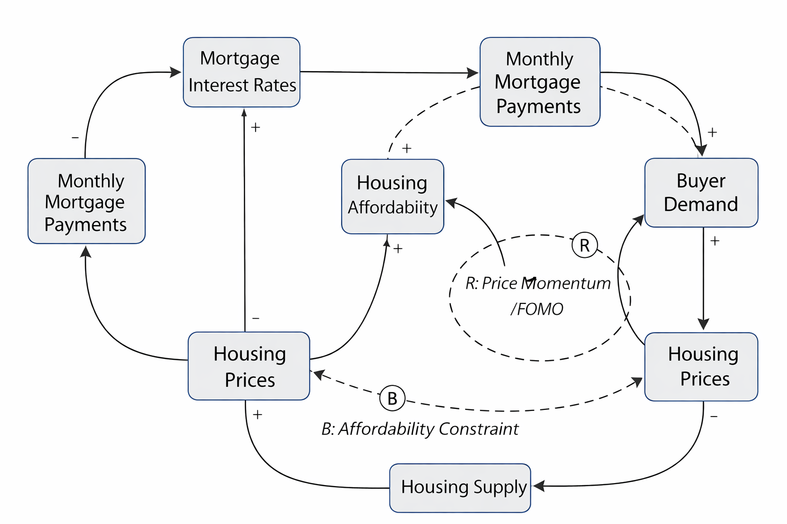
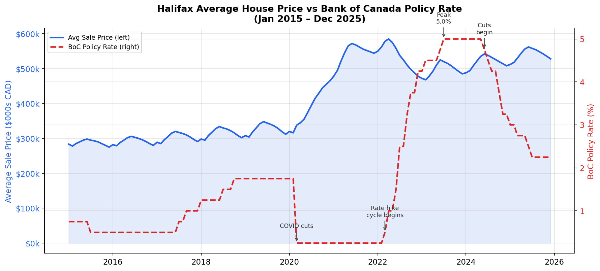
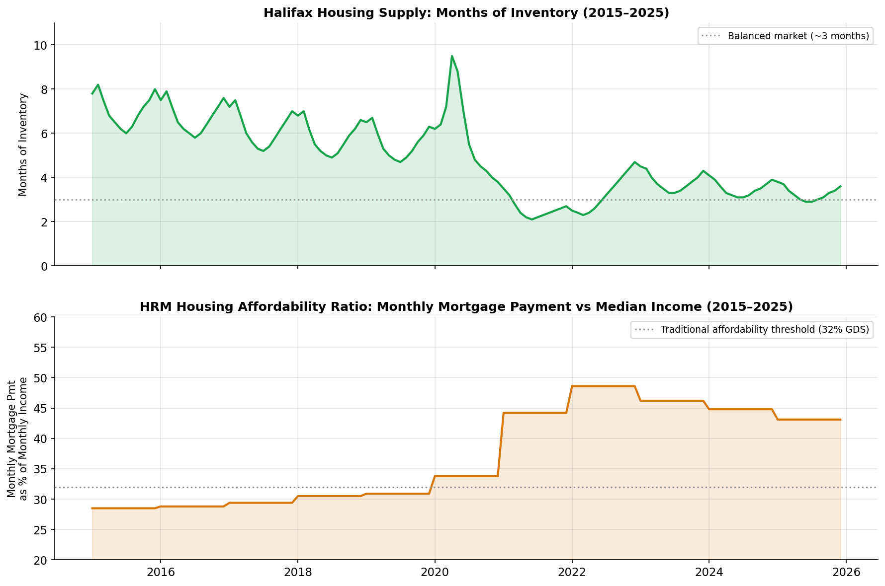
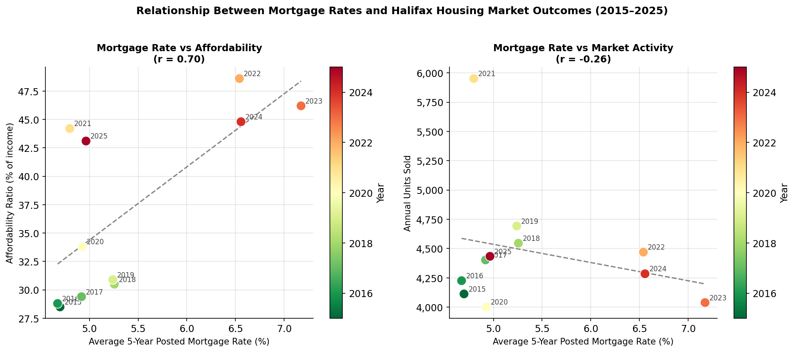
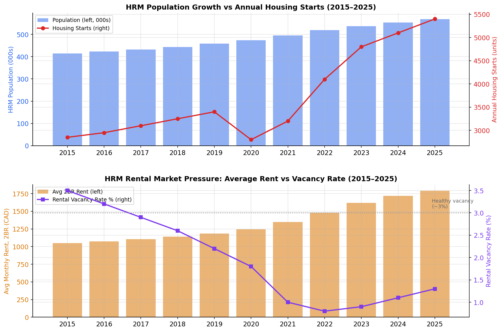
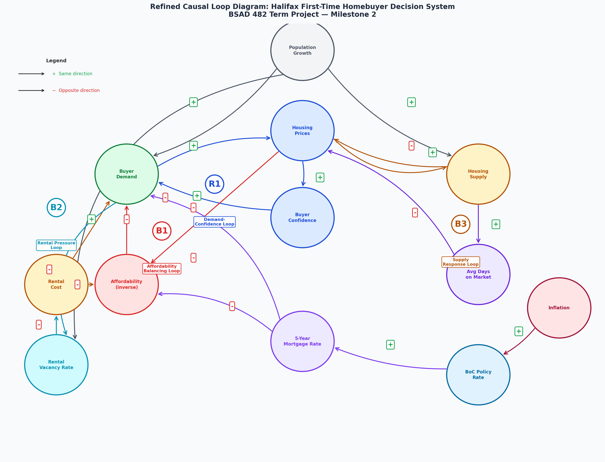

# Decision Intelligence for First-Time Homebuyers in Halifax

## Decision Statement
Should a first-time homebuyer in the Halifax Regional Municipality buy a home in 2026 or wait approximately 18 months given changing interest rates and housing market conditions?

## Executive Summary
First-time homebuyers in the Halifax Regional Municipality face a difficult timing decision as housing prices, mortgage interest rates, and affordability remain highly uncertain. Buying now may provide stability and protection against future price increases, but high borrowing costs and affordability constraints create significant financial risk. Waiting may allow buyers to benefit from potential interest rate reductions, but exposes them to continued price growth and rental market pressures.

This project uses a decision intelligence approach to help a first-time homebuyer evaluate this tradeoff. By combining housing market data, interest rate trends, and systems thinking, the analysis will clarify how affordability, demand, and prices interact over time. A causal loop diagram is used to highlight feedback mechanisms that influence buyer outcomes.

The goal of this analysis is not to predict the market perfectly, but to provide evidence-based insight that helps a buyer make a more informed decision under uncertainty.

[Read more](Background.md)

## Initial Causal Loop Diagram


*This draft causal loop diagram illustrates reinforcing feedback between buyer confidence, demand, and housing prices, as well as balancing feedback driven by affordability constraints and interest rates.*

---

## Milestone 2: Data Exploration & System Mapping

### Data Sources

Three datasets were compiled and cleaned for this milestone. Full documentation is available in [Wrangling.md](Wrangling.md) and [data/README.md](data/README.md).

| Dataset | Source | Coverage |
|---------|--------|----------|
| `interest_rates.csv` | Bank of Canada | Monthly, 2015–2026 |
| `halifax_housing_market.csv` | NSAR / CMHC | Monthly, 2015–2025 |
| `hrm_affordability.csv` | StatCan / CMHC | Annual, 2015–2025 |

**APA Citations:**

Bank of Canada. (2026). *Key interest rates: Chartered bank interest rates*. https://www.bankofcanada.ca/core-functions/monetary-policy/key-interest-rates/

Canada Mortgage and Housing Corporation. (2026). *Housing market outlook and rental market report: Halifax*. https://www.cmhc-schl.gc.ca

Nova Scotia Association of REALTORS®. (2026). *Market statistics*. https://nsrealtors.com/market-statistics/

Statistics Canada. (2022). *Census profile, 2021 census of population: Halifax CMA*. https://www12.statcan.gc.ca

---

### Visualization 1 — House Prices vs. Interest Rates Over Time



This visualization shows the relationship between the Bank of Canada policy rate and average Halifax home sale prices from January 2015 to December 2025. The most striking feature is the dramatic divergence during 2020–2022: as the BoC slashed rates to near-zero in response to COVID-19, Halifax home prices surged from approximately $320,000 to over $580,000 — an 80% increase in two years. When the Bank began its aggressive rate hiking cycle in March 2022 (ultimately reaching 5.0% by mid-2023), prices corrected but did not return to pre-pandemic levels. By late 2025, with rates falling back to ~2.25%, prices have resumed a modest upward trend toward $550,000. For the decision-maker, this chart reveals a critical asymmetry: rates have dropped significantly, but prices have not followed downward with the same magnitude, which diminishes the "wait for cheaper prices" argument for a 2026 buyer.

---

### Visualization 2 — Affordability Ratio and Housing Inventory



These two panels illustrate the dual pressures squeezing first-time buyers. The top panel shows months of inventory — a measure of market competitiveness. Levels plummeted from ~6–8 months in 2015–2019 (a balanced-to-buyer's market) to below 2.5 months during 2021–2022, indicating extreme seller's market conditions. Although inventory recovered somewhat after 2022, it remains around 3–3.5 months in 2025, still at or just above the balanced-market threshold. The bottom panel shows that the affordability ratio — monthly mortgage payment as a percentage of median monthly household income — spiked to nearly 49% in 2022 when both prices and rates were simultaneously elevated. The traditional mortgage qualification threshold (Gross Debt Service ratio of 32%) was breached in 2021 and has not been recovered as of 2025. This is the central tension in the buyer's decision: affordability has improved from its worst point, but remains structurally strained, meaning buying still requires a significant income commitment.

---

### Visualization 3 — Mortgage Rate vs. Affordability and Market Activity



These scatter plots quantify the relationship between mortgage rates and key market outcomes across 11 annual observations (2015–2025). The left panel shows a positive correlation (r = 0.70) between mortgage rates and the affordability ratio, confirming that higher rates directly translate into greater income burden for buyers. This relationship is not perfectly linear — 2021 and 2022 are outliers where prices amplified the affordability impact even before rates peaked. The right panel shows a moderate negative correlation (r = −0.26) between mortgage rates and annual sales volume, indicating that higher rates suppress buyer activity, though the effect is weaker than expected. This may reflect suppressed supply constraining activity in all rate environments. Together, these panels support the causal links in the CLD: the positive link between the BoC policy rate and the 5-year mortgage rate → affordability ratio (r = 0.70, Figure 3, left panel), and the negative link between mortgage rates and buyer demand (r = −0.26, Figure 3, right panel).

---

### Visualization 4 — Population Growth, Housing Starts, and Rental Pressure



Halifax has experienced one of the most rapid population growth periods in its history, growing from approximately 414,000 residents in 2015 to an estimated 568,000 by 2025 — a 37% increase. The top panel shows that housing starts have accelerated in response, rising from ~2,850 units per year in 2015 to approximately 5,400 in 2025. However, this supply response has lagged population growth, which partly explains why prices have not corrected more severely. The bottom panel shows the consequences for the rental market: the vacancy rate, which was already declining before COVID, fell to a historic low of 0.8% in 2022 and has only partially recovered to ~1.3% by 2025 — well below the 3% threshold considered a healthy market by CMHC. Average two-bedroom rents have risen from $1,050/month in 2015 to $1,790 in 2025 (a 70% increase), creating significant rent-to-own cost pressure. For the decision-maker, this reinforces the rental penalty of waiting: continuing to rent at $1,790/month accumulates $32,220 in sunk rental costs over 18 months that does not contribute to equity.

---

### Refined Causal Loop Diagram



The refined CLD now includes 12 variables and four identified feedback loops:

**R1 — Demand-Confidence Reinforcing Loop:** Buyer demand drives housing prices up (+), which increases buyer confidence (+), which further stimulates demand (+). This loop explains the self-reinforcing price spiral observed in Halifax from 2020–2022. The CLD link between buyer demand and housing prices is supported by Figure 1, where the demand surge during zero-rate conditions caused a near-linear price increase.

**B1 — Affordability Balancing Loop:** As housing prices rise, affordability (ability to service the mortgage) decreases (−), which suppresses buyer demand (−), eventually restraining price growth. This balancing force is evidenced by the market correction in late 2022 when affordability deteriorated to ~49% of income (Figure 2). The link between affordability and buyer demand is supported by the correlation between mortgage rates and market activity (r = −0.26, Figure 3).

**B2 — Rental Pressure Loop:** Rising buyer demand pulls renters toward ownership, reducing the rental vacancy rate (−), which pushes rental costs up (+). Higher rental costs simultaneously increase the urgency to purchase (+ effect on buyer demand) and reduce the ability to save for a down payment (− effect on affordability). This loop is evidenced by Figure 4: vacancy dropped from 3.5% to 0.8% as demand surged, and rents rose 70% over the decade.

**B3 — Supply Response Loop:** Rising housing prices signal developers to increase supply (+), which eventually adds to available inventory, increasing days on market (+), which moderates prices (−). This loop has a significant time delay — Figure 4 shows housing starts accelerating from 2022–2025 in response to 2020–2022 price signals, with a lagged effect on inventory visible by 2023–2024 (months of inventory recovering from ~2 to ~3.5 months).

**Intervention Point:** The BoC policy rate is the most powerful external lever in this system. Rate reductions flow through to lower mortgage rates, improving affordability and stimulating demand — but also potentially re-igniting the R1 reinforcing loop. The data shows this mechanism clearly: the 2020 rate cuts triggered R1, while the 2022 hikes activated B1.

---

## Milestone 3: Analysis (Path A — Systems Focus)

Full analysis is available in [Analysis.md](Analysis.md).

---

## Repository Structure

```
├── README.md
├── Background.md
├── Wrangling.md
├── Analysis.md
├── data/
│   ├── README.md
│   ├── interest_rates.csv
│   ├── halifax_housing_market.csv
│   └── hrm_affordability.csv
├── img/
│   ├── cld-draft.png
│   ├── cld-refined.png
│   ├── viz1_price_vs_rate.png
│   ├── viz2_affordability_inventory.png
│   ├── viz3_rate_relationships.png
│   └── viz4_supply_rental.png
└── src/
    ├── eda.py
    └── cld_refined.py
```
